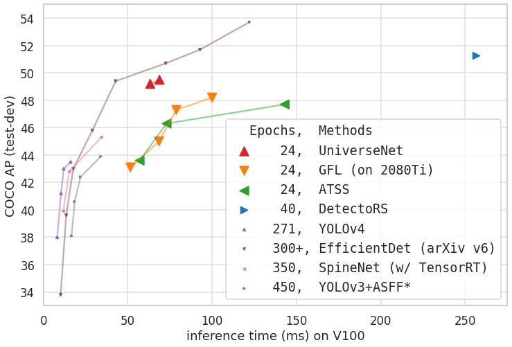

# UniverseNet

UniverseNet is the state-of-the-art detector that can be trained in 24 epochs.



UniverseNet+GFL (Res2Net-101) is further accurate (**val AP: 50.8**).

Concepts:
1. Universal scale detection
2. Universal training settings (standard hyperparameters)
3. Universal Background Model (base model to be transferred)

## Changelog

- 20.10 (Oct. 2020):
  - Add variants of UniverseNet 20.08
  - Update and fix codes for PyTorch 1.6.0, mmdet 2.4.0, mmcv-full 1.1.2
- 20.08 (Aug. 2020): **UniverseNet 20.08**
  - Improve usage of batchnorm
  - Use DCN modestly by default for faster training and inference
- 20.07 (July 2020): **UniverseNet+GFL**
  - Add GFL to improve accuracy and speed
  - Provide stronger pre-trained model (backbone: Res2Net-101)
- 20.06 (June 2020): **UniverseNet**
  - Achieve SOTA single-stage detector on Waymo Open Dataset 2D detection
  - Win 1st place in NightOwls Detection Challenge 2020 all objects track

## Features not in the original MMDetection

- [x] [UniverseNet](configs/universenet/)
- [x] SEPC
- [x] ATSS+SEPC, GFL+SEPC
- [x] ~~Test-time augmentation for ATSS and GFL~~ [merged](https://github.com/open-mmlab/mmdetection/commits?author=shinya7y)
- [x] [Classification weights rearrangement](tools/rearrange_weights.py)
- [x] [Waymo Open Dataset](mmdet/datasets/waymo_open.py)
- [x] [Waymo Open Dataset configs](configs/waymo_open/)
- [x] [NightOwls Dataset](mmdet/datasets/nightowls.py)
- [x] [NightOwls Dataset configs](configs/nightowls/)

## Acknowledgements

Some codes are modified from the repositories of [SEPC](https://github.com/jshilong/SEPC) and [NightOwls](https://gitlab.com/vgg/nightowlsapi).
When merging, please note that there are some minor differences from the above repositories and [the original MMDetection repository](https://github.com/open-mmlab/mmdetection).

<br><br>


<div align="center">
  
</div>

**News**: We released the technical report on [ArXiv](https://arxiv.org/abs/1906.07155).

Documentation: https://mmdetection.readthedocs.io/

## Introduction

MMDetection is an open source object detection toolbox based on PyTorch. It is
a part of the OpenMMLab project developed by [Multimedia Laboratory, CUHK](http://mmlab.ie.cuhk.edu.hk/).

The master branch works with **PyTorch 1.3 to 1.6**.
The old v1.x branch works with PyTorch 1.1 to 1.4, but v2.0 is strongly recommended for faster speed, higher performance, better design and more friendly usage.


### Major features

- **Modular Design**

  We decompose the detection framework into different components and one can easily construct a customized object detection framework by combining different modules.

- **Support of multiple frameworks out of box**

  The toolbox directly supports popular and contemporary detection frameworks, *e.g.* Faster RCNN, Mask RCNN, RetinaNet, etc.

- **High efficiency**

  All basic bbox and mask operations run on GPUs. The training speed is faster than or comparable to other codebases, including [Detectron2](https://github.com/facebookresearch/detectron2), [maskrcnn-benchmark](https://github.com/facebookresearch/maskrcnn-benchmark) and [SimpleDet](https://github.com/TuSimple/simpledet).

- **State of the art**

  The toolbox stems from the codebase developed by the *MMDet* team, who won [COCO Detection Challenge](http://cocodataset.org/#detection-leaderboard) in 2018, and we keep pushing it forward.

Apart from MMDetection, we also released a library [mmcv](https://github.com/open-mmlab/mmcv) for computer vision research, which is heavily depended on by this toolbox.

## License

This project is released under the [Apache 2.0 license](LICENSE).

## Changelog

v2.4.0 was released in 5/9/2020.
Please refer to [changelog.md](docs/changelog.md) for details and release history.
A comparison between v1.x and v2.0 codebases can be found in [compatibility.md](docs/compatibility.md).

## Benchmark and model zoo

Results and models are available in the [model zoo](docs/model_zoo.md).

Supported backbones:
- [x] ResNet
- [x] ResNeXt
- [x] VGG
- [x] HRNet
- [x] RegNet
- [x] Res2Net

Supported methods:
- [x] [RPN](configs/rpn)
- [x] [Fast R-CNN](configs/fast_rcnn)
- [x] [Faster R-CNN](configs/faster_rcnn)
- [x] [Mask R-CNN](configs/mask_rcnn)
- [x] [Cascade R-CNN](configs/cascade_rcnn)
- [x] [Cascade Mask R-CNN](configs/cascade_rcnn)
- [x] [SSD](configs/ssd)
- [x] [RetinaNet](configs/retinanet)
- [x] [GHM](configs/ghm)
- [x] [Mask Scoring R-CNN](configs/ms_rcnn)
- [x] [Double-Head R-CNN](configs/double_heads)
- [x] [Hybrid Task Cascade](configs/htc)
- [x] [Libra R-CNN](configs/libra_rcnn)
- [x] [Guided Anchoring](configs/guided_anchoring)
- [x] [FCOS](configs/fcos)
- [x] [RepPoints](configs/reppoints)
- [x] [Foveabox](configs/foveabox)
- [x] [FreeAnchor](configs/free_anchor)
- [x] [NAS-FPN](configs/nas_fpn)
- [x] [ATSS](configs/atss)
- [x] [FSAF](configs/fsaf)
- [x] [PAFPN](configs/pafpn)
- [x] [Dynamic R-CNN](configs/dynamic_rcnn)
- [x] [PointRend](configs/point_rend)
- [x] [CARAFE](configs/carafe/README.md)
- [x] [DCNv2](configs/dcn/README.md)
- [x] [Group Normalization](configs/gn/README.md)
- [x] [Weight Standardization](configs/gn+ws/README.md)
- [x] [OHEM](configs/faster_rcnn/faster_rcnn_r50_fpn_ohem_1x_coco.py)
- [x] [Soft-NMS](configs/faster_rcnn/faster_rcnn_r50_fpn_soft_nms_1x_coco.py)
- [x] [Generalized Attention](configs/empirical_attention/README.md)
- [x] [GCNet](configs/gcnet/README.md)
- [x] [Mixed Precision (FP16) Training](configs/fp16/README.md)
- [x] [InstaBoost](configs/instaboost/README.md)
- [x] [GRoIE](configs/groie/README.md)
- [x] [DetectoRS](configs/detectors/README.md)
- [x] [Generalized Focal Loss](configs/gfl/README.md)
- [x] [CornerNet](configs/cornernet/README.md)
- [x] [Side-Aware Boundary Localization](configs/sabl/README.md)
- [x] [YOLOv3](configs/yolo/README.md)
- [x] [PAA](configs/paa/README.md)

Some other methods are also supported in [projects using MMDetection](./docs/projects.md).

## Installation

Please refer to [install.md](docs/install.md) for installation and dataset preparation.


## Getting Started

Please see [getting_started.md](docs/getting_started.md) for the basic usage of MMDetection.
We provide [colab tutorial](demo/MMDet_Tutorial.ipynb) for beginners.
There are also tutorials for [finetuning models](docs/tutorials/finetune.md), [adding new dataset](docs/tutorials/new_dataset.md), [designing data pipeline](docs/tutorials/data_pipeline.md), and [adding new modules](docs/tutorials/new_modules.md).

For trouble shooting, please refer to [trouble_shooting.md](docs/trouble_shooting.md)

## Contributing

We appreciate all contributions to improve MMDetection. Please refer to [CONTRIBUTING.md](.github/CONTRIBUTING.md) for the contributing guideline.

## Acknowledgement

MMDetection is an open source project that is contributed by researchers and engineers from various colleges and companies. We appreciate all the contributors who implement their methods or add new features, as well as users who give valuable feedbacks.
We wish that the toolbox and benchmark could serve the growing research community by providing a flexible toolkit to reimplement existing methods and develop their own new detectors.


## Citation

If you use this toolbox or benchmark in your research, please cite this project.

```
@article{mmdetection,
  title   = {{MMDetection}: Open MMLab Detection Toolbox and Benchmark},
  author  = {Chen, Kai and Wang, Jiaqi and Pang, Jiangmiao and Cao, Yuhang and
             Xiong, Yu and Li, Xiaoxiao and Sun, Shuyang and Feng, Wansen and
             Liu, Ziwei and Xu, Jiarui and Zhang, Zheng and Cheng, Dazhi and
             Zhu, Chenchen and Cheng, Tianheng and Zhao, Qijie and Li, Buyu and
             Lu, Xin and Zhu, Rui and Wu, Yue and Dai, Jifeng and Wang, Jingdong
             and Shi, Jianping and Ouyang, Wanli and Loy, Chen Change and Lin, Dahua},
  journal= {arXiv preprint arXiv:1906.07155},
  year={2019}
}
```


## Contact

This repo is currently maintained by Kai Chen ([@hellock](http://github.com/hellock)), Yuhang Cao ([@yhcao6](https://github.com/yhcao6)), Wenwei Zhang ([@ZwwWayne](https://github.com/ZwwWayne)),
Jiarui Xu ([@xvjiarui](https://github.com/xvjiarui)). Other core developers include Jiangmiao Pang ([@OceanPang](https://github.com/OceanPang)) and Jiaqi Wang ([@myownskyW7](https://github.com/myownskyW7)).
